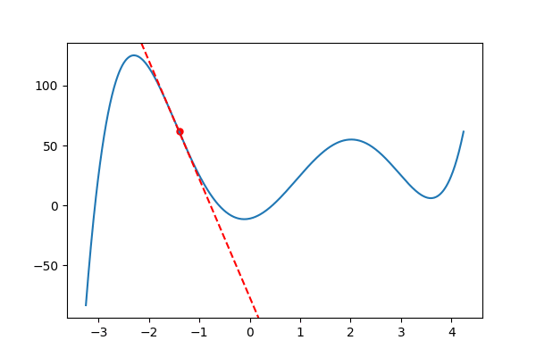
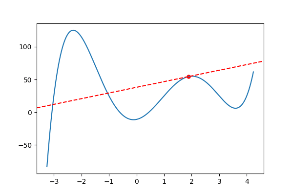

# Gradient Descent Project

This is where we are
implementing gradient descent with `SymPy`
modules and creating `gif` animations

## In 2d

We are trying to use the function: 

$$5 x^{4} - 16 x^{3} + 40 x^{2} + 9 x + 11$$

and find a local min from both sideS:

From the left:

From the right:

## In 3D looks like:

graphing a surface of equation:

$$\frac{\sin{\left(5 * \right)} \sin{left(5 y \right)}} {5}$$

Will give you an animation that looks like:

